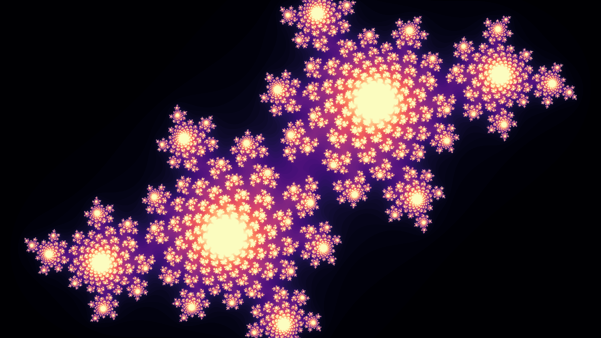

# Wallpapers
A repository containing nerdy wallpapers generated with matplotlib. It currently generates:
- Julia spiral
- Mandelbrot spiral
- Ulam spiral

## How to use
This repository depends on the following packages:
- matplotlib
- numpy

These dependencies can be installed manually or via `pip install -r requirements.txt`.

The wallpapers can be generated by simplying running `python main.py` in the root of the repository and will appear in the `images` directory.

Run `python main.py --help` to view the optional arguments for specifying the resolution and colormap.

### Images

